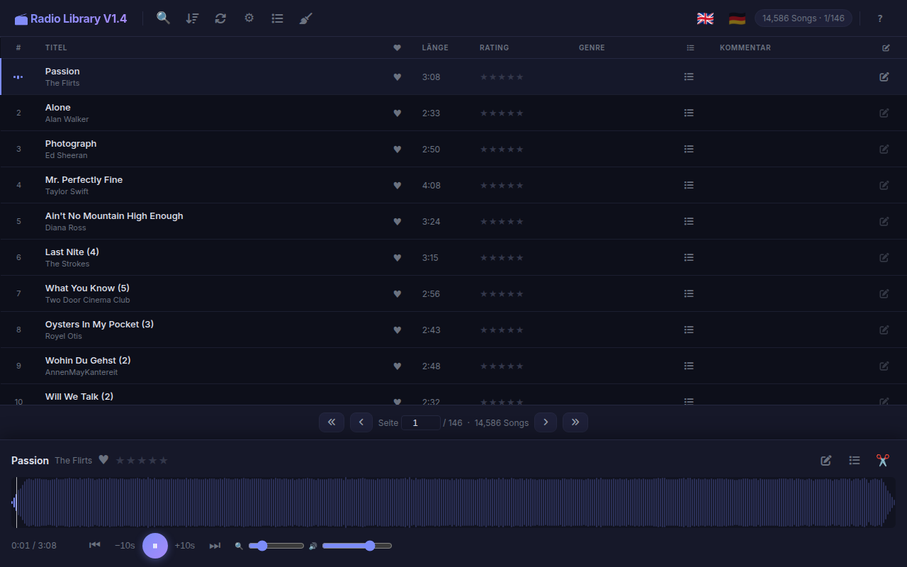
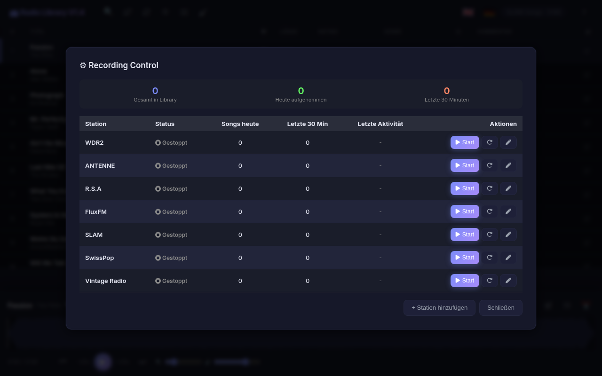
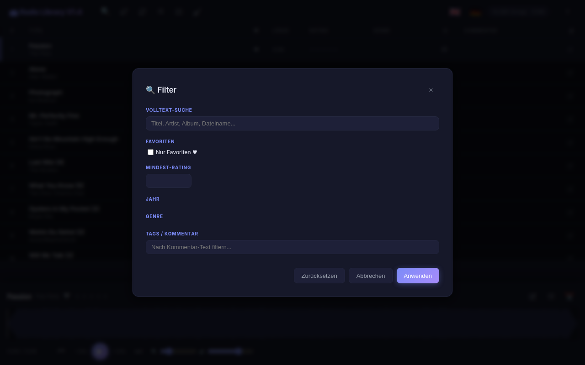
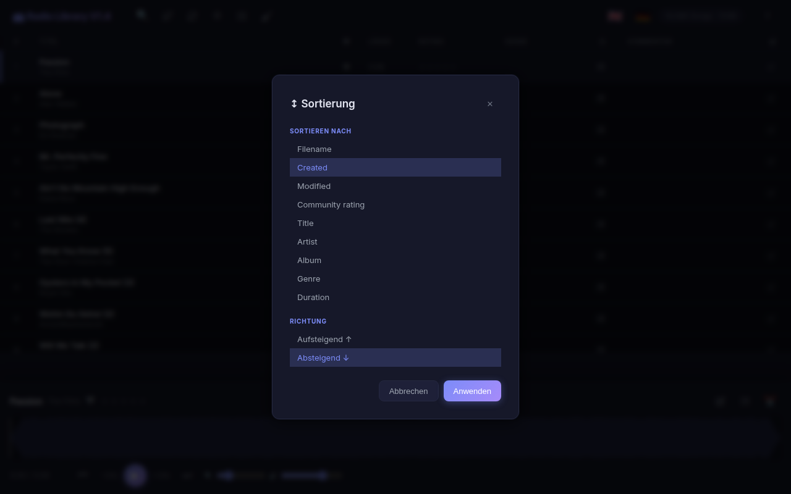
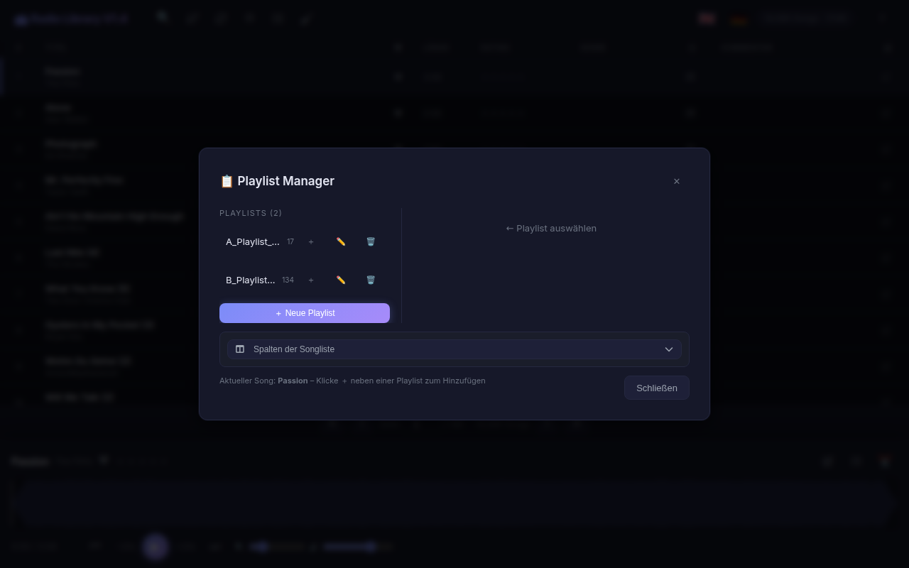
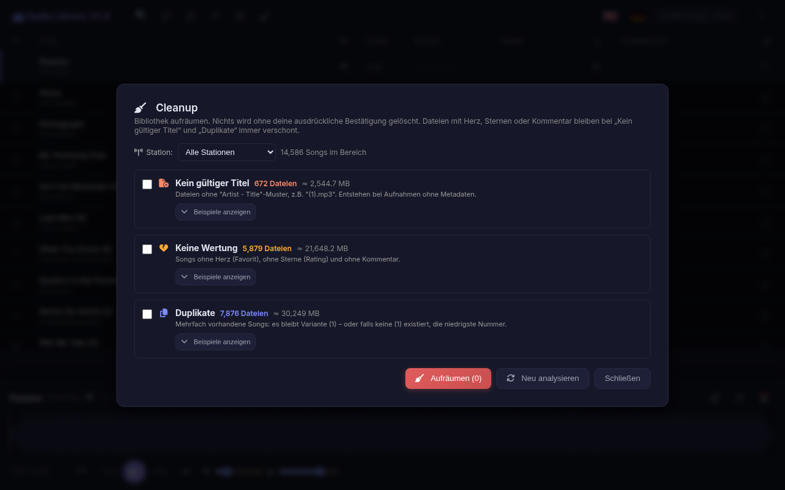
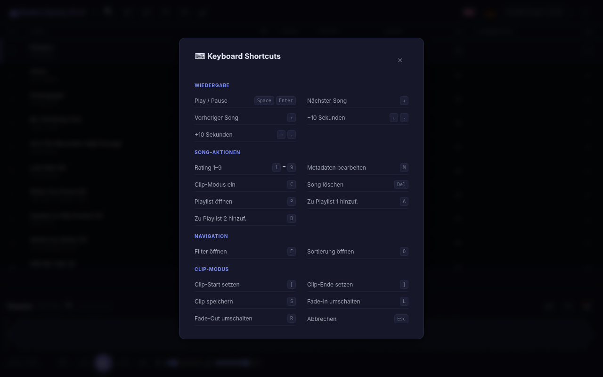

# Radio Library

**Build your own personal music library from internet radio streams.**

Radio Library records songs from internet radio stations, organizes them into a searchable music library with ID3 tags, and provides a rich waveform-based player — all accessible through a clean web interface.

## Why?

Streaming services come and go. Playlists disappear. Algorithms decide what you hear.

Radio Library lets you **own your music**. Every song played on your favorite radio stations gets automatically recorded, tagged, and added to your personal collection. Over time, you build a library that reflects *your* taste — not an algorithm's.

### What you get

- **Automatic recording** — Songs are split, tagged (Artist, Title, Album, Genre), and filtered (no ads, no jingles under 120s)
- **Your library, your rules** — Full control via a clean web UI. Rate songs, mark favorites, create playlists, edit metadata
- **Rich player** — Waveform visualization, clip mode (cut & save segments), keyboard shortcuts, multi-device
- **Self-hosted** — Runs in Docker. Your music stays on your hardware

## Screenshots

### Main Library View


### Player with Waveform


### Recording Control


### Filter


### Sort Order


### Playlist Manager


### Cleanup


### Keyboard Shortcuts


## Architecture

| Layer | Technology |
|-------|-----------|
| Frontend | React + Vite, WaveSurfer.js |
| Backend | FastAPI (Python), uvicorn |
| Proxy | nginx |
| Container | Docker + docker-compose |
| Recording | StreamRipper, managed by host daemon |

```
Browser (Web Audio)
    ↓
nginx :80 → SPA + /api proxy
    ↓
uvicorn :8000 (FastAPI)
    ↓
/mnt/radio/music/ (MP3 library)
    ↑
StreamRipper (host) → inbox → process → music
```

## Quick Start

```bash
# Build and run
docker compose up -d

# Open in browser
open http://localhost:8080
```

## Setup

### 1. Radio directory
Create `/mnt/radio` with this structure:
```
/mnt/radio/
├── config/stations.json    # Your radio stations
├── scripts/                # Recording scripts
├── inbox/                  # Temp recording storage
├── music/                  # Final music library
├── state/                  # Station enabled/disabled state
└── logs/                   # Recording logs
```

### 2. Stations config
Create `/mnt/radio/config/stations.json` (see `stations.example.json`):
```json
[
    {
        "name": "My Station",
        "url": "https://station.example.com/stream.mp3",
        "path": "MyStation",
        "default_enabled": false
    }
]
```

### 3. Recording daemon
Place `streamripper-manager.sh` in `/mnt/radio/scripts/` and set up a cron job:
```
@reboot /bin/bash /mnt/radio/scripts/streamripper-manager.sh manager &
```

### 4. Start
```bash
docker compose up -d
```

The manager daemon handles starting/stopping StreamRipper processes based on the state files managed by the UI.

## Features

### Player
- WaveSurfer.js waveform with zoom, seek, volume
- Clip mode: select start/end, fade in/out, save as new file
- Pre-fetch next song for gapless-ish playback
- Keyboard shortcuts (Space=play, arrows=seek, 1-9=rate, Del=delete)

### Library
- Full-text search (title, artist, album, filename)
- Filter by genre, year, rating, favorites
- Sort by date, title, artist, duration
- Star ratings & favorites (heart toggle)

### Recording Control
- Start/stop per station from the UI
- Live stats: total songs, today, last 30 minutes
- Orphan process cleanup via manager daemon
- State files as single source of truth

### Playlists & Clips
- Create, rename, delete playlists
- Add/remove songs via keyboard shortcuts (A/B)
- Clip mode: cut segments from any song with fades

### Metadata
- Edit ID3 tags (title, artist, album, genre, year)
- Batch rating

## Requirements

- Docker & docker-compose
- `/mnt/radio` directory (mounted as volume)
- StreamRipper installed on host
- `streamripper-manager.sh` recording daemon

## Version

V1.4

## License

MIT